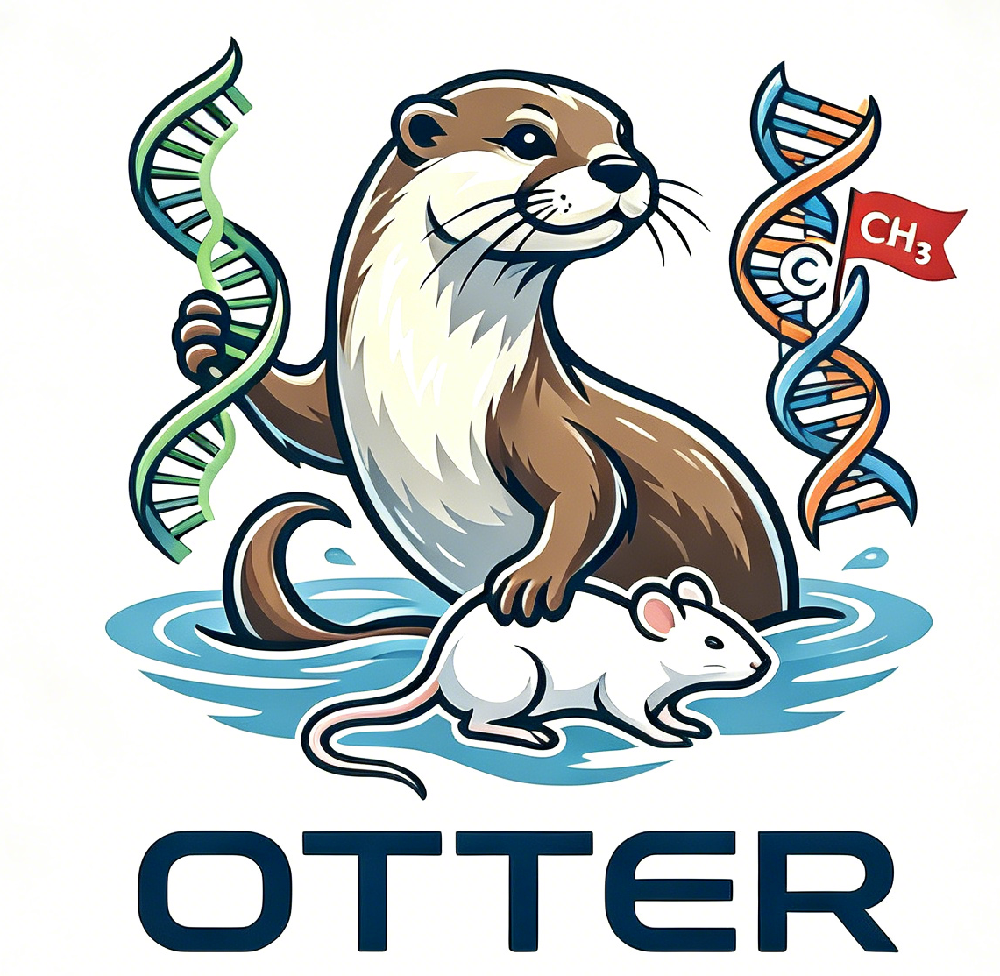

<p align="right">
  <strong>English</strong> · <a href="./README_zh.md">简体中文</a>
</p>

<p align="center">
  
</p>

<h1 align="center">OTTER</h1>

<p align="center">
  <strong>Orchestrated Transcriptomic, Tumor-xenograft (PDX/CDX), and Epigenomic Reporting Workflow</strong><br>
  A reproducible bioinformatics workflow CLI for RRBS, WGBS, RNA-seq, and PDX analysis.
</p>

<p align="center">
  <a href="#what-you-can-do">Features</a> ·
  <a href="#quick-start">Quick Start</a> ·
  <a href="#the-workflow-stack">Workflow Stack</a> ·
  <a href="#components">Components</a> ·
  <a href="#documentation">Documentation</a>
</p>

---

Otter turns FASTQ inputs and sample metadata into validated workflow projects, then runs them locally or on SLURM with task tracking, resumability, and auditable outputs.

## Proof

The repository ships an offline rehearsal that drives the real binaries through the whole
authoring and execution chain — `init`, `create`, site generation, run resolution, and a dry-run
plan — for four scenarios, plus the legacy migration path and the executor pairing boundary. The
registry is written to the production layout and verified by the production verifier, so the whole
rehearsal runs offline.

```text
$ bash scripts/e2e/otter_e2e.sh --otter ./otter --craftmake ./craftmake
  stages passed: 101
  stages failed: 0
```

A real authoring pass, against a release written by that same offline fixture strategy:

```text
$ otter init demo
Pinned inst/snakefiles -> workflows/ (23 files)

$ otter create --output demo --fastq ./fastq --pdata ./samples.csv --mode RRBS \
    --jobid demo --reference-root ./registry --reference-primary hg19@GRCh37.p13-gencode-v19
Identified 2 samples
Successfully paired 2/2 samples
Verifying declared references against the registry...
Reference primary verified: hg19@GRCh37.p13-gencode-v19 (Homo sapiens, manifest sha256:...)
Canonical project created successfully!
```

The rehearsal uses a simulated release, so the digest above is elided. In the deployed registry this
selection resolves to `manifest sha256:33dfd7d4ec0a90c6e11fdc45d02b2d4e9b6d82e4a607148d1ab467a0e555accc`,
recorded with its compute-node verification in the Gate 6 operations record.

<p align="center">
  
</p>

## What you can do

- Start a workflow project with `init` and generate a validated analysis configuration with `create`.
- Run RRBS, WGBS, RNA-seq, BS-PDX, and RNA-PDX workflows.
- Use local execution or SLURM. The backend and the per-phase CPU, memory, and partition envelope are fixed when a run is resolved, and the snapshot is authoritative at run time.
- Track background runs with `task list`, `task status`, `task logs`, `task stop`, and `task report`.
- Resolve canonical project files into immutable `otter.run/v1` snapshots with reference and resource identity.
- Validate published artifact manifests and checksums at the run boundary.

## The workflow stack

```text
otter → craftmake → enva → operators → bamdriver
  │         │         │         │          │
  │         │         │         │          └─ shared BAM/BGZF primitives
  │         │         │         └─ fastqcx · xenofilx · pairbam · seq2mat
  │         │         │            matsrun · qctb · methx
  │         │         └─ rattler-first runtime environments
  │         └─ native Local/SLURM executor and task state
  └─ project, configuration, workflow, and task control plane
```

The runtime is intentionally dual-track: production workflows use the Snakemake compatibility path
while `craftmake`, the native Go execution layer, is integrated and validated alongside it.

## Quick start

### Install a release

The release installer is a statically compiled Go binary published alongside the umbrella's
own releases:

```bash
curl -fsSL -o otter-install https://github.com/otterlab-bio/otter/releases/latest/download/otter-install-linux-amd64-static
chmod +x otter-install
./otter-install
```

The legacy shell installer remains available for compatibility:

```bash
bash <(curl -fsSL https://raw.githubusercontent.com/otterlab-bio/otter/main/scripts/install.sh)
```

### Build from source

```bash
git clone --recurse-submodules https://github.com/otterlab-bio/otter.git
cd otter
conda activate go-env
go build -o otter .
```

### Create and run a project

`otter init` and `otter create` default to the canonical v1 track, which is what `otter run` consumes.

```bash
otter init my_project

otter create \
  --output my_project \
  --fastq /data/fastq \
  --mode RRBS \
  --pdata /data/samples.csv \
  --jobid demo_rrbs \
  --reference-root /shared/otter/references \
  --reference-primary hg19@GRCh37.p13-gencode-v19

otter config validate --config my_project/project.yaml --schema v1
otter config resolve --project my_project/project.yaml --backend local \
  --reference-root /shared/otter/references

otter run \
  --config my_project/runs/<run-id>/run.yaml \
  --executor craftmake \
  --phase step1 \
  --backend local \
  --foreground
```

The snapshot records every path absolutely, so `otter run` does not need to be
started from the project directory — pass an absolute `--config` and it works
from anywhere. The one exception is `--run-id`, which resolves under the working
directory; pair it with `--project-dir` or `cd` in first.

`otter build` chains init, create, validate, and resolve into one step and stops
before execution. It defaults to the craftmake executor; `--executor snakemake`
records the Snakemake compatibility executor in the snapshot instead.

```bash
otter build \
  --project-root my_project \
  --fastq /data/fastq \
  --mode RRBS \
  --pdata /data/samples.csv \
  --reference-root /shared/otter/references \
  --reference-primary hg19@GRCh37.p13-gencode-v19 \
  --backend local
```

A reference is always selected as `<id>@<release>`. `create` verifies that selection against the
registry and writes the resolved identity to `references.lock.yaml`; `config resolve` then writes
the immutable `otter.run/v1` snapshot that `craftmake` executes.

The registry root is a deployment input rather than project state, so the project stays portable and
the root is supplied where it is used: give it to **both** commands with `--reference-root`, or set
`OTTER_REFERENCE_ROOT`, or use a site profile that declares it. The verified digest in
`references.lock.yaml` then proves the release is the same one. The executor, backend, phase,
references, and resource envelope are fixed in that snapshot, which is authoritative at runtime.

For a cluster run, replace `--backend local` with `--backend slurm` and supply the partition and
resource settings for your site. The default background mode prints a task ID:

```bash
otter task list
otter task status <task-id>
otter task logs <task-id> --follow
```

### Create and run a legacy-compatible project (compatibility track)

The Snakemake compatibility track requires `--legacy` on **both** authoring commands:

```bash
otter init my_project --legacy

otter create \
  --legacy \
  --fastq /data/fastq \
  --mode RRBS \
  --pdata /data/samples.xlsx \
  --output my_project/userspace \
  --jobid demo_rrbs
```

Legacy `otter.yaml` is an authoring format that **neither executor accepts
directly**. To run it, migrate it into a canonical project root, resolve a run,
and execute that snapshot:

```bash
otter init migrated
otter config migrate \
  --input my_project/userspace/demo_rrbs/config/otter.yaml \
  --output migrated/project.yaml \
  --reference-root /shared/otter/references \
  --reference-primary hg19@GRCh37.p13-gencode-v19

otter config resolve --project migrated/project.yaml \
  --reference-root /shared/otter/references --backend local

otter run --config migrated/runs/<run-id>/run.yaml \
  --executor snakemake --dry-run --foreground
```

`config migrate` writes project intent only, which is why it needs a canonical
root that already carries the pinned workflow assets. See
[reference migration](docs/manual/08-reference-migration.md).

## Components

| Component | Role | Repository |
| --- | --- | --- |
| `otter` | Workflow project and task control plane | [otterlab-bio/otter](https://github.com/otterlab-bio/otter) |
| `craftmake` | Native workflow compiler and Local/SLURM executor | [otterlab-bio/craftmake](https://github.com/otterlab-bio/craftmake) |
| `enva` | Rattler-first environment lifecycle manager | [otterlab-bio/enva](https://github.com/otterlab-bio/enva) |
| `fastqcx` | FASTQ QC with FastQC-compatible summary output | [otterlab-bio/fastqcx](https://github.com/otterlab-bio/fastqcx) |
| `xenofilx` | Graft/host read classification for PDX data | [otterlab-bio/xenofilx](https://github.com/otterlab-bio/xenofilx) |
| `pairbam` | Paired-end BAM filtering and ordering | [otterlab-bio/pairbam](https://github.com/otterlab-bio/pairbam) |
| `seq2mat` | HTSeq count-to-expression-matrix conversion | [otterlab-bio/seq2mat](https://github.com/otterlab-bio/seq2mat) |
| `matsrun` | rMATS pairwise splicing orchestration | [otterlab-bio/matsrun](https://github.com/otterlab-bio/matsrun) |
| `qctb` | Versioned QC summary reporting | [otterlab-bio/qctb](https://github.com/otterlab-bio/qctb) |
| `methx` | Bismark coverage and methylation HDF5 processing | [otterlab-bio/methx](https://github.com/otterlab-bio/methx) |
| `bamdriver` | Shared pure-Go BAM/BGZF library | [otterlab-bio/bamdriver](https://github.com/otterlab-bio/bamdriver) |

> The links above follow the public repository naming contract. Historical source symbols and old asset names may still contain `xdxtools`, `fastqc-rs`, `xenofilter-go`, `Paireads`, `htseq2matrix-go`, `gomats`, `methrix-cli`, or `bamdriver-go`; those names are retained only where compatibility or historical evidence requires them.

## Documentation

- [User manual](docs/manual/README.md) — installation, data preparation, quick start, modes, advanced usage, components, and FAQ.
- [Documentation index](docs/README.md) — entry point for the manual, examples, and schemas.
- [Worked examples](docs/examples/) — complete project configurations.
- [Schemas](docs/schema/) — configuration and manifest schemas.
- [Methx → native Methrix HDF5 exporter](methx/scripts/export_methrix_hdf5.R) — R-side interoperability path.

## Development

```bash
conda activate go-env
go test -v ./...
go vet ./...
```

Rust submodules use the `rust_build` environment. Each submodule is an independent repository; see its own README for focused build and test commands.

## License

MIT
